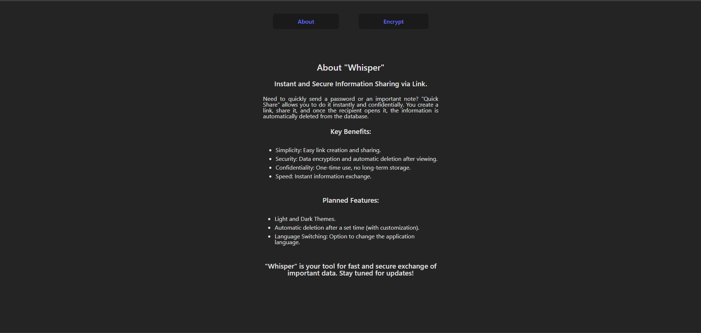

<a href="https://whisper-unhs.onrender.com" target="_blank" rel="noopener noreferrer"></a>

# Whisper

**Whisper** is a lightweight and secure tool for one-time data sharing via link. The shared data is encrypted before being saved and automatically removed after it's read.

## 🔐 Features

- One-time access to shared notes via a unique URL
- Stored data is **encrypted** — never saved in plain text
- Minimalistic and user-friendly interface

## 🛠️ Tech Stack

- **Backend**: Node.js, Express, Prisma, PostgreSQL
- **Frontend**: React (Vite)
- **Tooling**: TypeScript, ESLint, Prettier, Husky

## 📁 Project Structure

```
.
├── frontend/                # Frontend application (React + Vite)
│   ├── src/
│   │   ├── components/      # UI components
│   │   ├── pages/           # Application pages
│   │   ├── routers/         # Route definitions
│   │   └── main.tsx         # Entry point for the frontend
│   └── vite.config.ts       # Vite configuration
│
├── prisma/                  # Prisma ORM and database schema
│   └── schema.prisma
│
├── src/                     # Backend application (Node + Express)
│   ├── controllers/         # Route handlers
│   ├── routers/             # Express routes
│   ├── services/            # Business logic
│   └── index.ts             # Entry point for the backend
│
├── .env.example             # Example environment variables
├── package.json             # Project dependencies and scripts
├── README.md
└── tsconfig.json            # TypeScript configuration
```

## 🧪 Local Development

### For convenient development, I advise you to familiarize yourself with all the scripts in the `package.json` file

1. Clone the repository:
    ```bash
    git clone https://github.com/uncle-Yevhenii/whisper.git
    cd whisper
    ```
2. Install dependencies:

    ```bash
    npm run install:all
    ```

3. Create a .env file based on .env.example and configure database credentials
4. Build and start the project:
    ```bash
     npm run build:all
     npm run start
    ```

## 🔮 Planned Improvements

- [ ] Theme toggle (light/dark mode)
- [ ] Note lifetime customization (default: 24 hours, extendable to 72)
- [ ] Multilingual support (English, Ukrainian, etc.)

## 📄 License

This project is licensed under the [MIT](LICENSE) License.
You are free to use, copy, modify, and distribute it, provided you retain the copyright notice.
